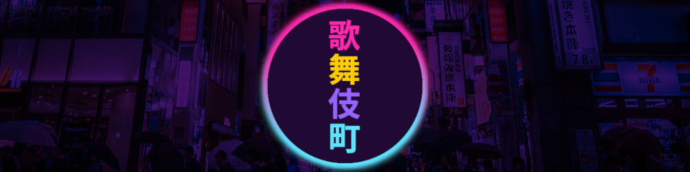
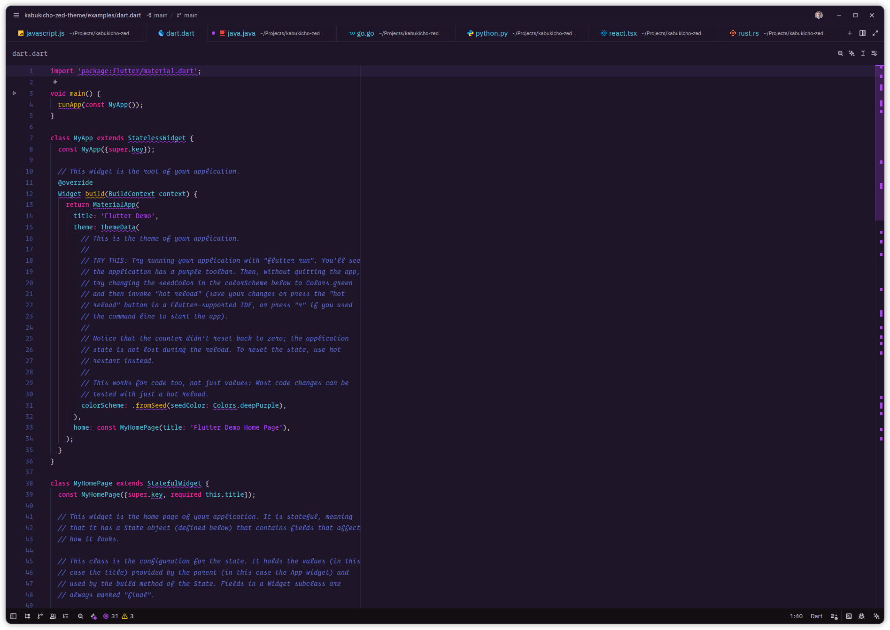
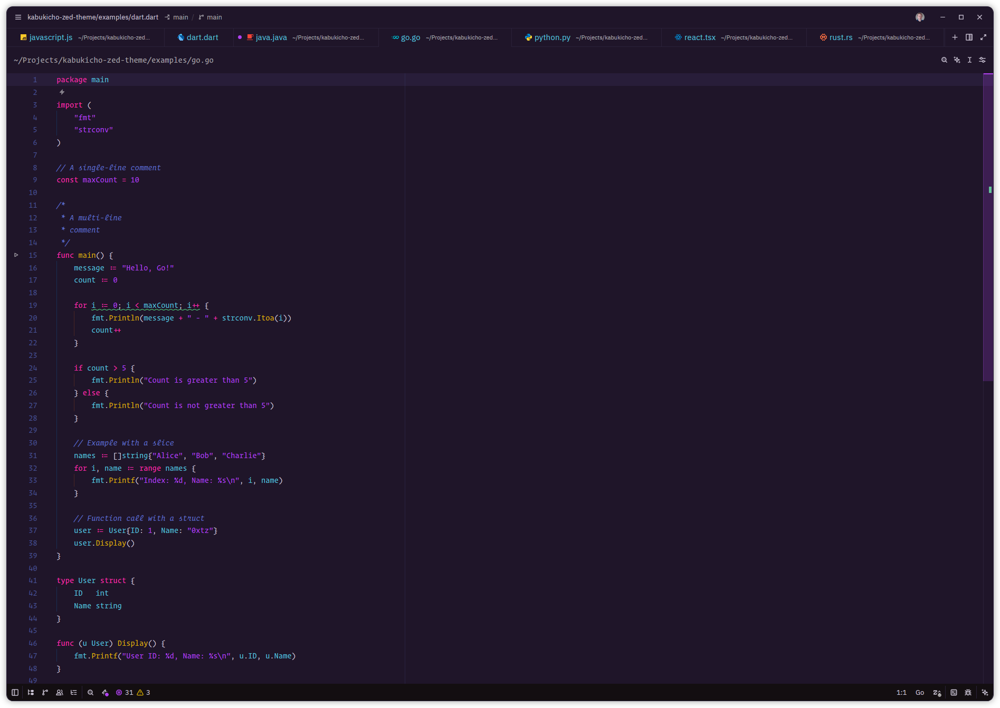
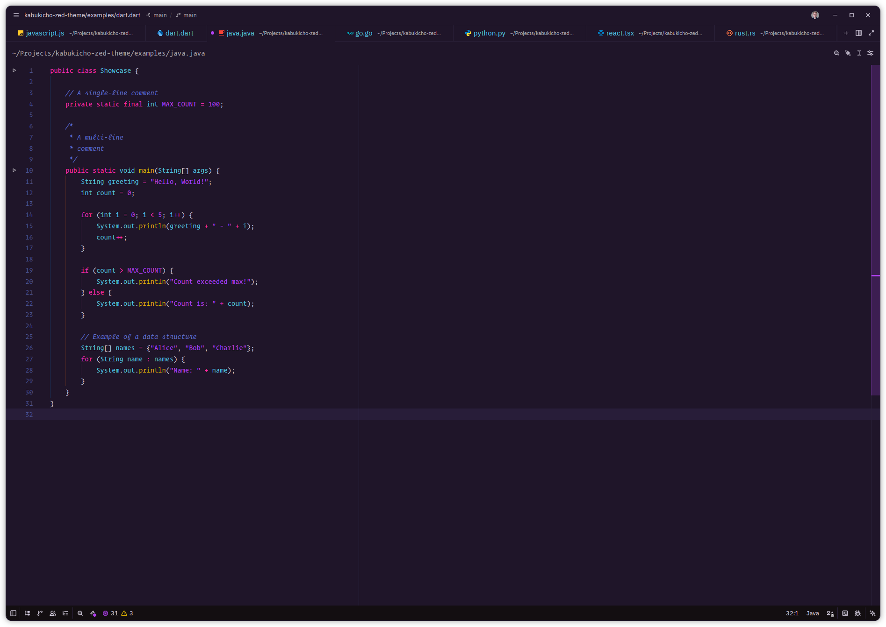
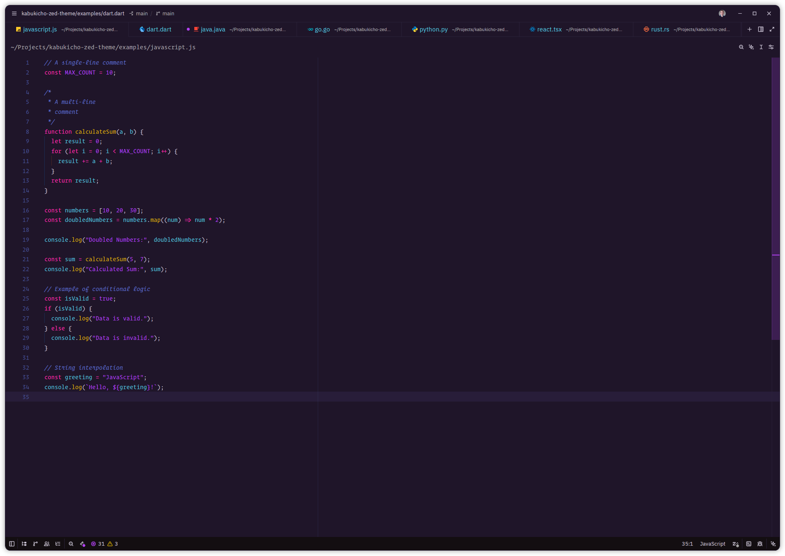
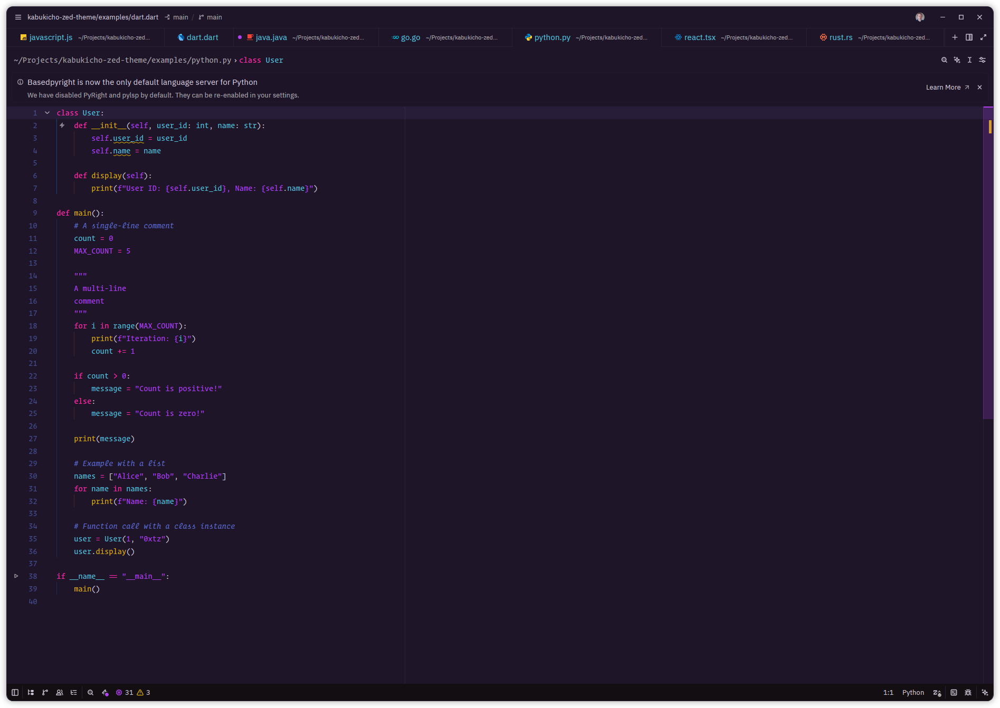
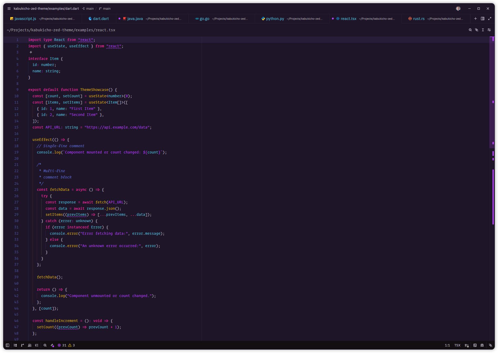
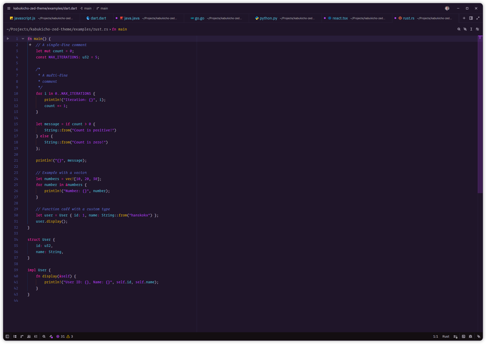

# Kabukichō Theme for Zed

A dark theme based on the original works of [Victoria Drake's VS Code extension](https://github.com/victoriadrake/kabukicho-vscode/).

In her own words, Kabukichō is "a techno-neon, autorobotic, VHS-degradaded, superatomic-AI color theme for Visual Studio Code. Of course those are real words. Whatever, man. You can't stop the signal."

## Screenshots

